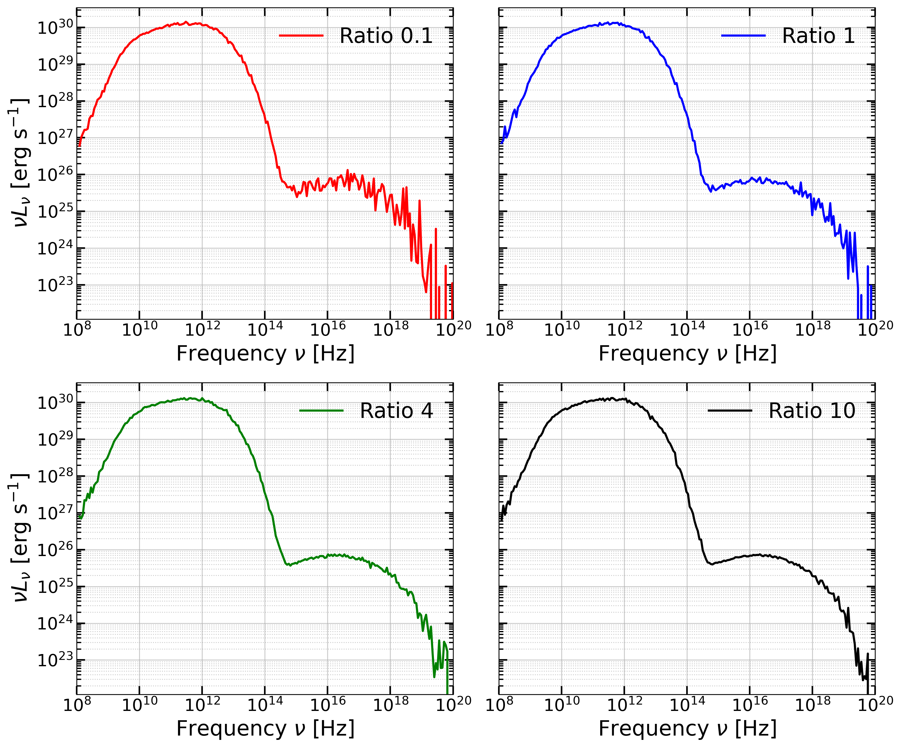

Scattering Bias-Tuning
======================

This document explains how the bias-tuning mechanism works in the scattering loop implemented in ``scattering_flow_control`` in ``scattering.cu``. The goal of this mechanism is to dynamically adjust the scattering bias so that the number of scattered photons remains close to a desired target ratio.

Motivation
----------

In Monte Carlo radiative transfer simulations, scattering events may produce **too many** or **too few** photons depending on the bias parameter

If too many photons are produced:

- memory usage increases
- computational cost grows quickly

If too few photons are produced:

- statistical noise increases
- scattering events are poorly sampled

To control this, the code dynamically adjusts a **bias-tuning parameter** (``biasguess``) to maintain a desired ratio between:

.. math::

   \mathrm{Ratio} = \frac{N_{\rm scat}}{N_{\rm in}}

where:

- :math:`N_{\rm scat}` is the number of scattered photons
- :math:`N_{\rm in}` is the number of incoming photons

Parameters
--------------------

``params.biasguess``
~~~~~~~~~~~~~~~~~~~~~

Scaling factor that modifies the scattering probability.

``params.targetRatio``
~~~~~~~~~~~~~~~~~~~~~~

Desired ratio between scattered photons and incoming photons. For example, a target ratio of 0.5 means the algorithm attempts to produce roughly **0.5 scattered photons per incoming photon**. In this
algorithm, we accept the tuning if it falls within ±20% tolerance.

Overview of the Algorithm
-------------------------

For each scattering round ``n``:

1. The photons from the previous round are copied into ``CurrentLayerScattering``.
2. A kernel (``track_scat``) is launched to simulate scattering.
3. The number of produced scattered photons is measured.
4. The ratio between scattered and incoming photons is computed.
5. If the ratio is outside the allowed interval, the bias is adjusted and the photons are re-tracked.

This process repeats until:

- The ratio falls within the acceptable range, or
- The maximum number of bias-tuning iterations is reached.
- The relative improvement in the ratio is less than 10%, indicating that further tuning may not be effective.

.. note::
    In the implementation, each scattering layer has its own bias-tuning parameter.
    The values are stored on the device in an array so that every scattering round :math:`n` uses its own value
    :math:`\mathrm{b}_n`. This allows the algorithm to adapt the
    scattering bias independently for each layer, since the probability of
    scattering and the number of generated photons can vary significantly
    between different layers.

Improvement
------------

   **Expected Result:** The resulting spectrum showing the :math:`\rm Ratio = 0.1, 1, 4, 10` showing improvement to the first scattering layer.

Usage Observations
-------------------

The following considerations may help ensure stability when using the bias-tuning algorithm in **GPUmonty**.

Target Ratio and Memory Limits
~~~~~~~~~~~~~~~~~~~~~~~~~~~~~~~~~

The **target ratio** should never exceed the value of ``SCATTERINGS_PER_PHOTON`` defined in ``config.h``. If this limit is exceeded, GPUmonty will target more scattering events than the GPU memory can handle, which can lead to **out-of-memory errors**.

For safety, it is recommended to set the target ratio **slightly below** ``SCATTERINGS_PER_PHOTON``. This provides a buffer that allows the algorithm to reach the desired ratio without hitting memory limits.

This limitation will be addressed in future versions of the code.

Very Optically Thin Plasmas
~~~~~~~~~~~~~~~~~~~~~~~~~~~

If the plasma is **too optically thin** (for example when ``M_unit`` is very small), the algorithm may struggle to produce scattering events even when using a large ``biasguess`` or target ratio.

Each scattering event reduces the **weight of the superphotons**, which may eventually make their contribution to the spectrum negligible. To prevent meaningless scatterings, the code enforces the condition::

    weight_scat > WEIGHT_MIN

As a result, simply increasing ``biasguess`` will not always increase the number of useful scattering events.

If the **relative improvement in the scattering ratio is less than 10%**, the tuning algorithm will stop adjusting the bias and accept the current value.

Invalid Memory Errors During Tracking
~~~~~~~~~~~~~~~~~~~~~~~~~~~~~~~~~~~~~~~~

If **invalid memory access errors** occur during the photon tracking phase, this usually indicates that the scattering configuration is too aggressive.

Possible solutions include:

- Reducing ``biasguess``.
- Increasing ``SCATTERINGS_PER_PHOTON`` in ``config.h``.

Increasing ``SCATTERINGS_PER_PHOTON`` allows the code to allocate memory for a larger number of potential scattering events per photon.